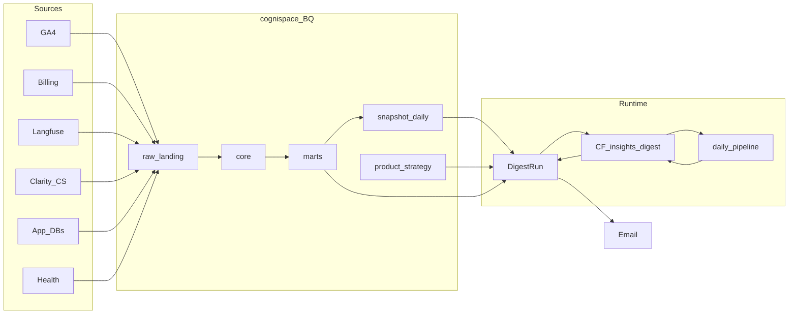

# Insights Digests — System Architecture

Hub: **`cognispace`** (BigQuery `EU`). Products: **`kih`** | **`lindle`** | **`yca`**.  
Delivery: **email Digests** (Slack later). No product UI — Decide/Aureyo removed.

Related: [strategy-recommendation.md](./strategy-recommendation.md) · [ui-setup-load-paths.md](./ui-setup-load-paths.md)

---

## One-line model

Sources land in cognispace → core/marts loaders → `snapshot_daily` → GenAI Digests grounded on marts facts → email.

```
SOURCES → raw / landing → core dims+facts → marts KPIs
                                              ↓
                                    marts_insights.snapshot_daily
                                              ↓
                         DigestRun + digest_facts + Gemini insights
                                              ↓
                                    email + digest_delivery
```

---

## Data flow

### End-to-end

| Stage | What | Examples |
|-------|------|----------|
| **Sources** | Product / cloud / AI / UX / app | GA4 Link, Billing export, Langfuse API, Clarity, App DBs, HTTP health |
| **Raw / landing** | Native or ETL landings | `analytics_<property_id>.*`, `raw_billing.*`, `raw_langfuse.daily_metrics`, `raw_clarity.daily_insights`, `raw_app.entities`, `raw_health.*` |
| **Core** | Dims + facts | `fct_sessions`, `fct_events`, `fct_gcp_cost`, `fct_llm_traces`, `fct_healthchecks`, `dim_product` / `dim_feature` / `dim_service` / `dim_user` / `dim_account` |
| **Marts** | Product KPI JSON blobs | `marts.growth`, `product`, `customer`, `ai`, `cost`, `reliability`, `executive` |
| **Digest contracts** | Typed SoT for inbox | `marts_insights.snapshot_daily`, `product_strategy`, `digest_delivery` |
| **Delivery** | Inbox | SMTP → `DIGEST_EMAIL_TO_*` |

### Source → warehouse (by lens)

| Lens | Path | Code |
|------|------|------|
| Growth / product / customer | GA4 `events_*` → `ga4_core` → `marts.growth\|product\|customer` | `integrations/bigquery/ga4_core.py` |
| Cloud $ | Billing export → `raw_billing` → `billing_core` → `fct_gcp_cost` + `marts.cost` | `integrations/bigquery/billing_core.py` |
| AI $ / traces | Langfuse API → `raw_langfuse` → `marts.ai` (+ `langfuse_core`) | `integrations/langfuse/` |
| Reliability | Health probes + Error Reporting → `marts.reliability` | `integrations/bigquery/healthchecks.py` |
| UX flags | Clarity ETL → snapshot flags | `integrations/clarity/` |
| App inventory | Postgres / Neo4j → `raw_app` + `dim_user` / `dim_account` | `integrations/app/` |
| Portfolio narrative | Facts pack → Gemini → `marts.executive` | `application/executive_layer.py` |

**Digest numbers path (MVP):** sources → (core/marts) → `build_snapshots` writes `snapshot_daily` → `digest_run` loads snapshot + `product_strategy` + **marts facts pack** → Gemini insights → email.

KIH/YCA billing may use stage-project export + scheduled copy into `cognispace.raw_billing` (see terraform billing bridges). Lindle can export directly to cognispace.

---

## Runtime

### Cloud Function `insights-digest`

| Piece | Location |
|-------|----------|
| Entry | `Narrate/main.py` → `digest_http` → `insights/entrypoints/handler.py` |
| Deploy | `Narrate/scripts/deploy_digest_fn.sh` (packs `Narrate/.env`) |
| Scheduler TF | `terraform/insights_digest.tf` (gated on `digest_function_url`) |

**HTTP actions** (`?action=`):

| Action | Role |
|--------|------|
| *(default)* / `all=1` | `digest_run` / `digest_run_all` |
| `daily_pipeline` | Full daily job (below) |
| `build_snapshots` | Write `snapshot_daily` |
| `langfuse_etl` | Langfuse → raw + marts.ai |
| `billing_core` / `ga4_core` / `langfuse_core` / `core_seed` | Warehouse loaders |
| `app_extract` / `healthchecks` / `looker_views` / `executive` | App dims, probes, Looker, portfolio |
| `clarity_etl` | Clarity → `raw_clarity` (also runs inside `daily_pipeline`) |

### Scheduler (Europe/Warsaw)

| Job | Cron | URL |
|-----|------|-----|
| `insights-daily-pipeline` | `0 6 * * *` | `?action=daily_pipeline&all=1` |
| `insights-weekly-digest` | `0 7 * * 1` | `?all=1&cadence=weekly` |

### `daily_pipeline` order

1. `langfuse_etl` → `raw_langfuse` + promote `marts.ai`  
2. `langfuse_core` → `dim_model`, `fct_llm_traces`  
3. `billing_core` → `fct_gcp_cost`, `marts.cost`  
4. `ga4_core` → sessions/events + `marts.growth|product|customer`  
5. `clarity_etl` → `raw_clarity.daily_insights` (Lindle/YCA when keys set)  
6. `healthchecks` → `marts.reliability`  
7. `build_snapshots` → `marts_insights.snapshot_daily`  
8. `app_extract` → app dims (when DB URLs set)  
9. `executive_summary` → `marts.executive`

### Weekly Digest path

```
LoadDigestData (snapshot + strategy)
        → gather_product_facts (marts + optional top cloud / executive)
        → Gemini enrich (insights + watch; details = grounding only)
        → strategy refresh (GTM hold; do not paste executive_skim)
        → render (KPIs + curated extras + Insights + Watch + Strategy)
        → EmailNotifier → digest_delivery
```

Code: `application/digest_run.py`, `digest_facts.py`, `render_digest.py`, `infrastructure/gemini_enricher.py`.

---

## Clean Architecture (Narrate)

```
Narrate/insights/
  domain/           # Product, Snapshot, Enrichment, ProductStrategyHold
  application/      # digest_run, digest_facts, render, executive_layer, …
  integrations/     # BigQuery, Langfuse, Clarity, app extractors
  infrastructure/   # repos, Gemini, email/Slack, wiring
  entrypoints/      # digest_http, daily_pipeline
```

Dependency rule: `entrypoints` → `application` → `domain` ← `infrastructure` / `integrations`.

---

## Benefits

| Benefit | Why it matters |
|---------|----------------|
| **Typed Digest SoT** | `snapshot_daily` is the vital-few contract; GenAI cites facts and must not invent metrics |
| **Fail-open GenAI** | Gemini enrich/strategy degrade to template; mail still sends |
| **Email-first MVP** | No UI tax; Decide deleted; stakeholders live in inbox |
| **One CF multiplexer** | Single deployable for ETL, warehouse, snapshots, Digests, executive |
| **Living GTM hold** | `product_strategy` refreshed each cadence via `gtm_structure` |
| **Billing bridges** | Cross-project exports can land in one hub without one shared billing account |
| **Product registry** | `integrations/products.py` centralizes GA4 / billing / Langfuse / UX IDs |

---

## Live vs WIP vs shells

### Live (code + contracts)

- Digests M1–M4: BQ path, Gemini insights, email, strategy hold  
- Snapshot builder + core loaders (GA4, billing, Langfuse, health)  
- `digest_facts` enrichment from marts  
- TF warehouse + digest Scheduler definitions  
- Function deploy script  

### WIP / ops-gated

| Item | Gap |
|------|-----|
| M5 Scheduler | Daily + weekly ENABLED — move to 16:00 / Mon 17:00 Warsaw (TF updated; apply still needed) so GA4 `events_*` has landed |
| Billing Lindle / YCA | In `cognispace.raw_billing` |
| Billing KIH | Need Console Detailed export → `dr-kiwi-app.raw_billing` (sync already scheduled) |
| GA4 `events_*` | Present for all three (as of 2026-09-16) |
| Clarity | ETL in `daily_pipeline` (needs product API keys) |
| App dims | Need `*_DATABASE_URL` / Neo4j secrets on Function |
| Langfuse pricing | Traces can exist while AI $ stays `$0` |
| Billing KIH | Stage `dr-kiwi-app.raw_billing` empty until Console Detailed export |

### Empty / placeholder shells

- `marts.marketing`, `marts.revenue`  
- `core.fct_orders`, `fct_subscriptions`, most unused `staging.*`  

---

## Potential improvements

### P0 — production automation & cost visibility

1. ~~Enable Cloud Scheduler API + apply digest jobs~~ (done — daily/weekly ENABLED).  
2. Finish Billing Detailed export for **KIH** on `dr-kiwi-app` → `raw_billing` (YCA + Lindle now in hub).  
3. ~~Confirm GA4 `events_*` for kih / lindle / yca~~ (present as of 2026-09-16).  
4. Smoke `daily_pipeline` then weekly `digest_run_all`; check `digest_delivery`.

### P1 — data quality & ops

1. Enable Langfuse model pricing (or keep surfacing AI cost gap in Digests).  
2. Observability: per-step status; watch Scheduler `attempt_deadline` (480s) vs full pipeline runtime.  
3. Prefer trusted marts in `snapshot_builder` once `ga4_core` is solid (reduce dual SQL paths).

### P2 — warehouse depth

1. Fill or drop shell marts (`marketing`, `revenue`) and unused staging.  
2. App → `fct_orders` / subscriptions when ready for conversion Digests.  
3. Slack as primary channel; monthly cadence job.  
4. Optional dbt/Dataform instead of Python MERGE sprawl.  
5. Prefer marts-only paths once loaders are fully trusted.

---

## Ops cheatsheet

```bash
# Deploy Function (from Narrate/; uses .env)
bash scripts/deploy_digest_fn.sh

# After URL is known — terraform/terraform.tfvars
# digest_function_url  = "https://….cloudfunctions.net/insights-digest"
# digest_function_name = "insights-digest"

gcloud services enable cloudscheduler.googleapis.com --project=cognispace
cd terraform && terraform apply

# Smoke
curl -sS 'https://…/insights-digest?action=daily_pipeline&all=1'
curl -sS 'https://…/insights-digest?product=kih&cadence=weekly'
```

Console checklist: [ui-setup-load-paths.md](./ui-setup-load-paths.md).

---

## Diagram (logical)



---

*Last updated: 2026-09-16 — reflects Narrate Digests + marts facts pack + email delivery.*
