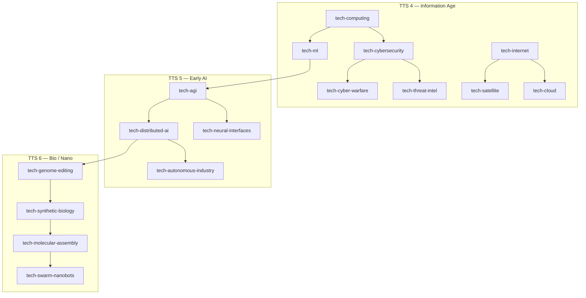

# RTS Mode — Real-Time Variant

**Codename:** Ascension Live  
**Genre:** Real-time strategy using TTS eras, tech, and hex map  
**Status:** Design only — **not** the default product; main TTS stays async governor  
**Repo relationship:** Speculative mode on shared `TTS.Core` ideas; does **not** replace [README.md](README.md) or [async-multiplayer-gameplay.md](async-multiplayer-gameplay.md)

**Related:**
- [v2/hex-map.md](v2/hex-map.md) — hex planet, territory claims (foundation for a live map)
- [tech-trees-by-tier.md](tech-trees-by-tier.md) — era tech as unit / building unlocks
- [match-modes.md](match-modes.md) — short live sessions vs 8h–48h async
- [ui-design.md](ui-design.md) — today: dashboard, not map-first RTS
- [company-sim.md](company-sim.md) — another “separate game” pattern

---

## 1. Why this doc?

TTS ships as **async grand strategy**: wall-clock ticks, short check-ins, governor dashboard.

This document answers: **how could the same fiction run as a real-time strategy game** — continuous sim, map control, direct orders — without changing the core IP (tiers, tech, stability, hex world).

| Main TTS (ship) | RTS mode (this design) |
|-----------------|------------------------|
| Async ticks (minutes–hours) | Continuous real-time (~1–10 Hz sim) |
| Decision gates + policy | Direct orders: build, move, attack, claim |
| Away summary | Players stay for the match |
| Dashboard-first | Full-bleed map-first |
| 8h–48h arcs | ~15–45 minute matches |

> Same world rules fiction. Different session: **live map control**, not check-ins.

---

## 2. High concept

**One sentence:**  
Two civilizations compete **1v1** on a hex planet in real time. Owning land funds production; research and **Technology Tier** jumps change what you can build and how fights work.

**Default start:** **TTS 4 (Information Age)** — same baseline as main match presets. Matches climb toward TTS 5–6 (MVP victory), not stone-age ladders.

**What “RTS” means here:**

1. Simulation advances every fraction of a second while the match is live  
2. Players issue **orders** on the map (not policy presets between ticks)  
3. Economy, army, and tech progress under **time pressure**  
4. Wins and losses resolve in one sitting  

TTS flavor (era shifts, stability vs power) is the differentiator — not cloning a specific commercial RTS.

---

## 3. Core loop

```
Expand territory → Earn yield → Produce / research → Fight or pressure → Repeat
```

| Phase | Player focus | TTS mapping |
|-------|--------------|-------------|
| Open | Claim adjacent hexes, start income | Continuous version of `TerritorySystem` claims |
| Early | Scout, first units, first buildings | TTS 4 roster (drones, cyber teams, forts) |
| Mid | Specialize research branch | Offense / defense / economy nodes from catalog |
| Late | Tier jump **or** commit army | TTS 5 kit + tighter stability, or mass TTS 4 |
| End | Push capital / hold objectives | Destruction first; other modes later |

### Session shape

| Setting | Decision |
|---------|----------|
| Players | **1v1 only** for R1–R4; FFA / 2v2 later |
| Start tier | **TTS 4** fixed for ranked/default |
| Victory target | Reach / pressure via TTS 5–6 band |
| Map | Seeded hex planet, compact (e.g. 18×14) |
| Length | ~20–40 minutes |
| Sim rate | Server tick every **100–250 ms** |
| Pause | Optional only vs AI / casual |

---

## 4. Economy

**Owned land hexes generate resources every second** (reuse biome + `ResourceYield` from [hex-map.md](v2/hex-map.md); make yield continuous instead of bootstrap-only).

```
Owned land hex
    → Resources /s
Grid / infrastructure hexes (higher tiers)
    → Energy for advanced buildings and units
Stability
    → Soft cap: large armies and high-tier tech drain it;
      overreach → unrest, desertion, or crime spikes
```

| Lever | Effect |
|-------|--------|
| More hexes | More income |
| Forward outpost | Distant cluster for staging + income |
| Extractors / buildings | Multiply or unlock yield types |
| Overbuild army | Stability drops → weaker fights / events |

---

## 5. Tech and eras

### Starting TTS

**All default Live matches start at TTS 4 (Information Age).**

| Why TTS 4 | Detail |
|-----------|--------|
| Aligns with main product | Same as `sprint-8h` / async presets |
| Instant fiction | Cyber, drones, grids, crime/stability — readable on first look |
| Short ladder | TTS 4 → 5 → 6 fits a 20–40 min match |
| Avoids stone slog | TTS 1–3 stay out of Live MVP (optional custom lobby later) |

Optional later lobbies (not MVP): Industrial start, AI-vanguard handicap, Classic stone long ladder.

### How army tech works

Research is **not** a separate abstract tree from the army. Each Live-relevant catalog node either:

1. **Unlocks a unit or building**, or  
2. **Upgrades** an existing one (HP, damage, vision, cost), or  
3. **Enables the tier jump** (spine cores)

One research queue. Player picks the next node; when it finishes, the unlock appears in the build/train bar.

```
Start (TTS 4 baseline unlocked)
    → branch research (Cyber / Grid / Orbit)
    → stronger TTS 4 army
    → spine cores → Tier jump to TTS 5
    → new unit kit (AI)
    → spine → TTS 6 kit (Bio/Nano)
```

**Baseline at match start** (no research yet): capital, pioneer, patrol drone, grid outpost. Everything else is earned in-match from the TTS 4–6 catalog.

### Research branches (Live spine)

Curated subset of [catalog.json](src/data/tech/catalog.json) — not the full async tree.



| Branch | Key nodes | Army payoff |
|--------|-----------|-------------|
| **Cyber** | cybersecurity → cyber-warfare / threat-intel | Raiders, disable buildings, vision |
| **Orbit** | internet → satellite | Long vision, detection, late map intel |
| **Cognition** | ml → agi → distributed-ai | TTS 5 units + faster produce |
| **Bio/Nano** | genome → synthetic → swarm nanobots | TTS 6 glass-cannon swarm |

Forbidden nodes (`tech-mass-surveillance`, `tech-recursive-ai`, …) = optional **high-risk** unlocks: strong unit/ability, immediate stability hit.

### Unit roster (MVP)

Roles stay readable: scout, worker, raider, line, siege, defense.

#### TTS 4 — always-on kit + unlocks

| Unit | Unlock | Role | On-map look |
|------|--------|------|-------------|
| **Pioneer** | Baseline | Claim hexes, build | Small wedge / worker marker, team color |
| **Patrol drone** | Baseline | Scout, cheap vision | Flat diamond above hex, light trail |
| **Grid outpost** | Baseline | Expand income / rally | Hex pad with corner posts |
| **Cyber team** | `tech-cyber-warfare` | Raid, harass economy | Pair of upright bars (team color + cyan edge) |
| **Firewall node** | `tech-cybersecurity` | Static defense | Low cube with shield glyph |
| **Signal relay** | `tech-threat-intel` | Vision building | Thin mast + pulse ring |
| **Orbital uplink** | `tech-satellite` | Wide vision / detect cloaked | Dish silhouette on pad |
| **Strike battery** | `tech-cyber-warfare` + lab | Short-range siege vs buildings | Angled block, muzzle flash on fire |

#### TTS 5 — after tier jump (needs AGI spine)

| Unit | Unlock | Role | On-map look |
|------|--------|------|-------------|
| **Autonomic swarm** | `tech-distributed-ai` | Cheap mass line | Cluster of 3–5 dots that move as one token |
| **Agent cell** | `tech-neural-interfaces` | Specialist (high value) | Single bright core + orbiting pip |
| **Fabricator** | `tech-autonomous-industry` | Faster unit production building | Multi-bay pad, soft glow |

TTS 4 units remain trainable but **efficiency favors the new kit** (swarm cheaper; drones stay for scout).

#### TTS 6 — after second jump

| Unit | Unlock | Role | On-map look |
|------|--------|------|-------------|
| **Bio-strike cadre** | `tech-synthetic-biology` | High damage, fragile | Elongated organic spike, green-teal tint |
| **Nano cloud** | `tech-swarm-nanobots` | Area chip damage / melt forts | Soft translucent blob over hex |
| **Hive scaffold** | `tech-molecular-assembly` | Late production / heal aura | Lattice dome |

### How an army “looks” in play

See **§9 Graphics** and the concept sheet for the full visual language. Short version: **colored geometric tokens on hexes** (not soldiers) — diamond drones, bar-pair cyber teams, dot-cluster swarms — with HP bars, stack counts, and era accent colors (cyan → violet → teal).

### Buildings (train / support)

| Building | Tier | Does |
|----------|------|------|
| Capital | 4 | Must protect; trains pioneers; lose = defeat |
| Extractor | 4 | Multiplies hex yield |
| Lab | 4 | Enables research queue + strike battery |
| Barracks / Net bay | 4 | Trains cyber team / drones |
| Fabricator | 5 | Replaces net bay efficiency |
| Hive scaffold | 6 | Late produce + local repair |

Cap ≈ **6 building types** + **8 unit types** across TTS 4–6 for MVP.

### Upgrades (same queue)

Examples — research finishes → all existing matching units gain the buff:

| Node | Upgrade |
|------|---------|
| `tech-cloud` | −10% train time |
| `tech-predictive-analytics` | +drone vision radius |
| `tech-quantum-sim` | +agent cell damage |
| `tech-cognitive-enhancement` | +bio-strike HP |

### Combat feel by era

| Era | Army fantasy |
|-----|----------------|
| **TTS 4** | Position, vision, raids — cyber disable > brute force |
| **TTS 5** | Numbers + automation — swarm floods, agent picks targets |
| **TTS 6** | Glass cannons — melt a fort then shatter if stability tanks |

Stability still bites: huge TTS 6 deathballs without economy/outposts fight worse and can desert.

---

## 6. Map, fog, combat

### Spatial rules

| Action | Behavior |
|--------|----------|
| Move | Select units → target hex; pathfind |
| Attack | Engage when in range of enemy unit / building |
| Claim | Pioneers / workers claim adjacent neutral land |
| Contested | Armies on border hexes deal damage each sim tick |
| Capital | Lose capital → defeat (or timed collapse) |

Regions can remain labels (names, crime fiction). **Hexes + units + buildings** are the live game state.

### Fog of war

- Unexplored hexes hidden  
- Vision from units and outposts  
- Optional late satellite vision (expensive, brittle) — fits existing satellite fiction  

### Combat (keep simple)

Deterministic server math; no physics projectiles for v1:

```
each combat tick:
  for each engagement:
    damage = f(attack, armor, tier gap, local stability)
    optional morale / retreat on stability shock
```

---

## 7. Architecture

Async TTS: Orleans grain + scheduled ticks + REST.

RTS mode:

```
Client (map UI)
  → WebSocket (or similar) orders
  → Authoritative match sim
  → State snapshots / deltas to clients
```

| Concern | Approach |
|---------|----------|
| Authority | Server-only (same as `TTS.Core` philosophy) |
| Sync | Server-sim first; prediction later if needed |
| Hosting | Dedicated RTS sim host, or grain that runs continuous loop |
| AI | Classical order AI first; optional TTS 5+ LLM that emits **orders**, never blocks combat |

Reuse tech catalog, biomes, naming, lobby ideas. **Do not** reuse hour-scale tick schedules.

Suggested layout later:

- `TTS.Rts.Core` — units, combat, real-time economy  
- Shared hex + tech models  
- `TTS.Web` route e.g. `/live` — separate from governor `/match`

---

## 8. UI and hotkeys

Map is the primary surface.

| Region | Content |
|--------|---------|
| Center | Live hex map, units, selection |
| Bottom | Commands: build, stance, research, claim |
| Top | Resources, energy, stability, match timer |
| Edge | Minimap, alerts (under attack, tier ready) |

Governor chrome (away summary, long gate essays, policy-only flows) stays out of this mode. Optional **short** mid-match choices (“unlock forbidden line?”) can appear as quick modals — seconds, not hours.

### Hotkeys (MVP)

Goal: play without hunting the command bar. Mouse for targeting; keyboard for speed.

| Key | Action |
|-----|--------|
| **Left-click** | Select unit / building |
| **Shift+click** | Add to selection |
| **Drag box** | Multi-select |
| **Right-click** | Move / attack-move / set rally (context) |
| **A** then click | Attack-move |
| **S** | Stop |
| **H** | Hold position |
| **G** | Claim / expand (pioneer selected) |
| **B** | Build menu (then letter for building) |
| **R** | Open / confirm research queue focus |
| **F1** | Select capital |
| **Space** | Jump camera to last alert (under attack) |
| **1–0** | Control groups (select) |
| **Ctrl+1–0** | Assign control group |
| **Tab** | Cycle subgroups in selection |
| **Esc** | Clear selection / close menu |
| **+ / −** or wheel | Zoom |
| **WASD** or edge scroll | Pan |
| **M** | Toggle minimap focus / ping (optional) |

Build submenu example after **B**: **E** extractor, **O** outpost, **L** lab, **F** fortress.

Control groups **1–0** are required for MVP 1v1 — without them, late-game micromanagement feels broken.

---

## 9. Graphics — how it looks

**Direction:** board-game clarity on a dark tactical hex planet — **not** cinematic soldiers, **not** cartoon chibi. Think “readable tokens on the existing Three.js hex map,” tinted with [Slate Tactical](DESIGN.md) colors.

**Concept sheet:** [assets/rts-live-unit-visual-concept.png](assets/rts-live-unit-visual-concept.png)

### Camera and world

| Piece | Look |
|-------|------|
| Camera | Tilted top-down / shallow iso over a flat hex field (same family as `HexMapView`, not a spinning trade globe while playing) |
| Terrain | Soft flat hexes: muted greens, greys, dark water — low extrude, no photoreal rock |
| Ownership | Player A warm orange fill wash; Player B cool steel-blue wash on owned hexes |
| Fog | Unseen hexes near-black; seen-empty dim; visible normal |
| Lighting | One cool key light; whole map gets a slight **violet wash** after TTS 5 jump, **teal wash** after TTS 6 |

### Unit tokens — **sprites** (not CSS boxes / low-poly meshes)

Units and buildings are **billboard sprites** painted to canvas (concept silhouettes: diamond drone, twin orange bars, shield cube, purple swarm, cyan agent, teal nano cloud). Same art is reused in the bottom roster strip.

Hex terrain stays 3D; tokens are 2D sprites that always face the camera — closer to the concept sheet than extruded meshes.

| Token | Sprite look |
|-------|-------------|
| Patrol drone | Grey diamond + cyan trail glow |
| Cyber team | Twin neon-orange bars |
| Firewall node | Dark cube + cyan shield glyph |
| Autonomic swarm | Purple orb cluster |
| Agent cell | Bright cyan core + pip |
| Nano cloud | Soft teal translucent blob |
| Capital | Hex pad + vertical beacon beam |

### Buildings

Flat **pads** on hexes, not skyscraper models:

- Capital = larger raised platform + beacon light  
- Outpost = pad + four corner posts  
- Lab / net bay = pad + small mast or dish  
- Fabricator / hive = multi-bay pad; hive gets a light lattice dome at TTS 6  

### Era read (without new art packs)

| Era | Visual cue |
|-----|------------|
| TTS 4 | Clean cyan edges, grid-ish rims, hard shapes |
| TTS 5 | Violet accents, swarm dots, soft glow on agent |
| TTS 6 | Teal organic overlays, blob meshes, map tint shift |

Same engine meshes; **palette + silhouette swap** sells the tier jump.

### HUD

React overlay on top of the WebGL canvas (trade-globe pattern): top strip for resources / stability / timer; bottom command card; minimap corner. Dark slate panels `#051424` / `#122131`, text `#d4e4fa`, accents cyan + orange — match DESIGN.md, not a second skin.

### What we deliberately do **not** ship in MVP

- Unique humanoid character models or walk cycles  
- Photoreal terrain / weather sims  
- Cutscenes  
- Per-unit skeletal animation (tokens slide / bob only)  

### What exists today to build on

| Asset | Tech | Role |
|-------|------|------|
| Match hex map | Three.js (`createThreeHexMap.ts` + `HexMapView`) | Hex planet, ownership colors, pick |
| Trade / satellite globes | Three.js | Lighting / overlay reference only |
| HUD | React + CSS | Panels on top of canvas |

### Polish ladder

| Phase | Visual bar |
|-------|------------|
| **R1–R2** | Colored hexes + placeholder tokens + selection ring + fog darkening |
| **R3** | Final silhouettes, team colors, attack flash, path ghosts |
| **R4+** | Era accent skins + map tint on tier jump |

---

## 10. Victory

| Mode | When | Win condition |
|------|------|----------------|
| **Destruction** | **MVP** | Destroy enemy capital / last production |
| **Ascension** | Later | Reach target tier and hold objective hexes for N seconds |
| **Score** | Later | Most territory + army value at time limit |

Same fantasy as async (tier + control), resolved under live pressure.

---

## 11. Reuse vs rewrite

| Reuse | New |
|-------|-----|
| Tech catalog & tiers (TTS 4+ spine) | Continuous sim loop (ms ticks) |
| Hex generation + biomes + Three.js map | Units, buildings, pathfinding, hotkeys |
| Stability / progress tension | Real-time combat |
| Lobby / join codes | Order + state stream protocol |
| Win/loss concepts | Full-bleed Live client |

---

## 12. Phased build

| Phase | Deliverable | Playable? |
|-------|-------------|-----------|
| **R0** | This design | No |
| **R0.5** | Visual sandbox (`/live`) — flat hex + unit tokens from concept sheet | Visual only |
| **R1** | Local 1v0: TTS 4 start, claim + income + one unit, basic hotkeys | Sandbox |
| **R2** | Combat + fog + **1v1** local / AI, control groups | Yes |
| **R3** | Networked 1v1 + lobby, graphics polish | Yes online |
| **R4** | Tier jumps 4→5→6 + fuller roster | Full RTS loop |
| **R5** | Balance / ranked 1v1 | Product |

Until R1, the shipped product remains async.

---

## 13. Risks

| Risk | Mitigation |
|------|------------|
| Scope (full RTS from scratch) | 1v1, TTS 4 only, destruction victory, tiny roster |
| Art sink | Icons / low-poly on existing hex WebGL; no custom hero meshes |
| Diluting async brand | Explicit “Live / RTS” mode; governor stays default |
| Tier snowball | Tier jump costs time; early army must threaten |
| Sim + Orleans timers | Dedicated continuous host for combat rate |
| LLM in the fight loop | Never block ticks on LLM |

---

## 14. Summary

**Ascension Live** is TTS as RTS:

1. **1v1**, starts at **TTS 4**  
2. Map is the game (Three.js hex + React HUD)  
3. Income from owned hexes in real time  
4. Hotkeys + control groups for real play  
5. Tech and **tier jumps** change the toolkit  
6. Stability limits overreach  
7. Short, decisive matches  

Main TTS: *check in → decide → leave*.  
RTS mode: *stay on the map → win or lose now*.

---

## Open questions

1. Separate Live playlist from async lobby, or shared join codes?  
2. Exact TTS 6 unlock timing vs “win at capital kill before anyone tiers”?  
3. Remap hotkeys for AZERTY / non-QWERTY in settings from day one?
